# MVP — Pipeline de Dados na Nuvem: preço do gás de cozinha no Brasil

Construção de um pipeline de dados de ponta a ponta no **Databricks Free Edition**,
sobre a Série Histórica de Preços de GLP P13 da ANP, seguindo a arquitetura
medalhão (Bronze, Silver, Gold) e modelagem em esquema estrela.

**Autor:** João Victor de Assis Natividade

**Matrícula**: 4052025002212

**Disciplina:** Engenharia de Dados — MVP

**Plataforma:** Databricks Free Edition (Unity Catalog, Delta Lake, Spark serverless)

**Período analisado:** julho de 2024 a agosto de 2026 (26 meses)

**Volume:** 271.945 registros, 5.073 revendas, 421 municípios, 27 UFs

| Etapa | Notebook |
|---|---|
| Coleta | [`coleta_anp_glp.py`](coleta_anp_glp.py) |
| Bronze | [`00_ingestao_bronze.py`](notebooks/00_ingestao_bronze.py) |
| Silver | [`01_bronze_para_silver.py`](notebooks/01_bronze_para_silver.py) |
| Gold — dimensões | [`02_gold_dimensoes.py`](notebooks/02_gold_dimensoes.py) |
| Gold — fato | [`03_gold_fato.py`](notebooks/03_gold_fato.py) |
| Qualidade | [`04_qualidade_dados.py`](notebooks/04_qualidade_dados.py) |
| Gold — agregados | [`05_gold_agregados.py`](notebooks/05_gold_agregados.py) |
| Análise | [`06_analise_perguntas.py`](notebooks/06_analise_perguntas.py) |
| Exportação | [`07_exportar_resultados.py`](notebooks/07_exportar_resultados.py) |

## Sumário

1. [Contexto de Negócios e Perguntas (Etapa 2 e 4.1)](#contexto-de-negócios-e-perguntas-etapa-2-e-41)
2. [Carga dos Dados (Etapa 4.2)](#carga-dos-dados-etapa-42)
3. [Modelagem e Catálogo de Dados (Etapa 4.3)](#modelagem-e-catálogo-de-dados-etapa-43)
4. [Pipeline de Dados (Etapa 4.4)](#pipeline-de-dados-etapa-44)
5. [Qualidade de Dados (Etapa 4.5)](#qualidade-de-dados-etapa-45)
6. [Análise de Dados (Etapa 4.5)](#análise-de-dados-etapa-45)
7. [Autoavaliação](#autoavaliação)

## Em uma página

O botijão de 13 kg é um produto fisicamente idêntico em todo o Brasil, mas seu
preço não é. Este trabalho separa a dispersão em duas escalas com consequências
opostas para a família: o ruído acionável, BRL 7,86
na mediana entre
revendas da mesma cidade na mesma semana e o ruído estrutural, de R$ 44,63 entre Recife e Boa Vista,
que nenhuma decisão do consumidor alcança. A hierarquia regional não se alterou em 26 meses, e o
Norte sequer acompanha o movimento nacional de preços. Em 14 das 25 capitais
analisadas, um botijão custa mais que a linha mensal de extrema pobreza por
pessoa.

A discussão completa está em
[Análise de Dados](#análise-de-dados-etapa-45); as limitações do que os dados
permitem afirmar, ao final daquela seção e na
[Autoavaliação](#autoavaliação).

---

# Contexto de Negócios e Perguntas (Etapa 2 e 4.1)

## Por que o gás de cozinha

O Brasil não possui malha significativa de gás natural canalizado para uso
residencial. Na prática, o **GLP envasilhado é a principal fonte energética de
cocção doméstica no país** e o botijão de 13 kg (P13) é, por definição, o
formato residencial, distinto do P45 usado em aplicação comercial. Analisar o
preço do P13 é, portanto, analisar diretamente uma despesa recorrente de quase
todo domicílio brasileiro.

Isso muda a natureza da pergunta. A dispersão de preço de um produto homogêneo
não é curiosidade estatística: é orçamento doméstico. Um botijão é fisicamente
idêntico em Recife e em Boa Vista mesmo gás, mesmo peso, mesma norma. Toda
variação de preço observada vem de geografia, estrutura de distribuição,
concorrência local ou tempo. Nenhuma vem do produto.

## Problema

**O que explica a dispersão do preço do botijão de GLP P13 no Brasil, e qual o
impacto dessa dispersão sobre o orçamento das famílias?**

Interessa em particular separar dois tipos de dispersão com consequências
práticas opostas:

- **Ruído acionável** — variação entre revendas da mesma cidade. A família pode
  contorná-la pesquisando preço.
- **Ruído estrutural** — variação entre regiões e ao longo do tempo. A família
  não tem como contorná-la.

## Perguntas de negócio

1. Qual a diferença de preço médio do P13 entre as regiões e entre as UFs? Essa
   diferença é estável ao longo do período ou muda?
2. Dentro do mesmo município e da mesma semana, qual a dispersão de preço entre
   revendas? Quanto uma família economiza pesquisando?
3. Revenda de bandeira branca é mais barata que revenda bandeirada? Em quanto, e
   isso varia por região?
4. Municípios com mais revendas apresentam preços menores — há sinal de
   concorrência local?
5. Como o preço médio evoluiu mês a mês nos 26 meses? Houve quebras de nível?
6. Quando o preço sobe, as regiões se movem juntas ou de forma independente?
7. A margem bruta da revenda (venda − compra) varia por região ou por bandeira?

Conforme orientação do enunciado, **nenhuma pergunta foi removida** ao longo do
trabalho. A pergunta 7 mostrou-se não respondível com esta fonte; a limitação
está documentada na seção de Análise e discutida na Autoavaliação.

## Contexto dos dados brutos

Os dados vêm do **Levantamento de Preços de Combustíveis (LPC)**, pesquisa
semanal realizada por empresa contratada pela ANP em cumprimento ao artigo 8º da
Lei nº 9.478/1997 (Lei do Petróleo). A pesquisa registra o preço praticado por
revendedores ao consumidor final, abrangendo gasolina C, etanol hidratado, óleo
diesel B, GNV e GLP P13. Este trabalho utiliza exclusivamente o recorte de GLP.

**Fonte:** [Série Histórica de Preços de Combustíveis e de GLP — ANP](https://www.gov.br/anp/pt-br/centrais-de-conteudo/dados-abertos/serie-historica-de-precos-de-combustiveis)
**Órgão responsável:** ANP/SDC — Superintendência de Defesa da Concorrência
**Periodicidade:** semanal, com publicação agrupada mensal e semestral

### Arquivos utilizados

A ANP publica os mesmos dados em recortes semestrais e mensais. Optou-se pelos
semestrais sempre que disponíveis, reduzindo de 26 downloads mensais para 6
arquivos com fronteiras temporais limpas.

| Arquivo                                        | Período | Registros | Tamanho |
|------------------------------------------------|---|---:|---:|
| [`glp_2024S2.csv`](dados_brutos/glp_2024S2.csv)  | jul–dez/2024 | 38.425 | 6,21 MB |
| [`glp_2025S1.csv`](dados_brutos/glp_2025S1.csv)  | jan–jun/2025 | 71.780 | 11,45 MB |
| [`glp_2025S2.csv`](dados_brutos/glp_2025S2.csv)  | jul–dez/2025 | 53.423 | 8,29 MB |
| [`glp_2026S1.csv`](dados_brutos/glp_2026S1.csv)  | jan–jun/2026 | 80.187 | 12,98 MB |
| [`glp_2026M07.csv`](dados_brutos/glp_2026M07.csv) | jul/2026 | 13.775 | 2,23 MB |
| [`glp_2026M08.csv`](dados_brutos/glp_2026M08.csv) | ago/2026 | 14.355 | 2,32 MB |
| **Total**                                      | | **271.945** | **43,5 MB** |

### Estrutura dos dados brutos

Arquivo único por período, formato CSV, codificação UTF-8 com BOM, separador
ponto e vírgula, decimal com vírgula, datas em `dd/MM/yyyy`. **Uma tabela com 16
colunas**, idênticas em ordem e nome nos seis arquivos (verificação automatizada
na ingestão).

| # | Coluna original | Descrição |
|---:|---|---|
| 1 | `Regiao - Sigla` | Sigla da região geográfica da revenda |
| 2 | `Estado - Sigla` | Sigla da UF da revenda |
| 3 | `Municipio` | Município da revenda |
| 4 | `Revenda` | Razão social da revenda |
| 5 | `CNPJ da Revenda` | CNPJ da revenda |
| 6 | `Nome da Rua` | Logradouro |
| 7 | `Numero Rua` | Número do logradouro |
| 8 | `Complemento` | Complemento do endereço |
| 9 | `Bairro` | Bairro |
| 10 | `Cep` | CEP |
| 11 | `Produto` | Combustível pesquisado |
| 12 | `Data da Coleta` | Data da coleta do preço |
| 13 | `Valor de Venda` | Preço ao consumidor final |
| 14 | `Valor de Compra` | Preço de distribuição (descontinuado em ago/2020) |
| 15 | `Unidade de Medida` | Unidade do preço |
| 16 | `Bandeira` | Marca comercial exibida pela revenda |

**Granularidade:** uma coleta de preço, de um produto, em uma revenda, em uma
data. Não há chave primária declarada; a chave de negócio é
`CNPJ + Data da Coleta + Produto`, cuja unicidade foi verificada.

O dicionário oficial de metadados da ANP está preservado no repositório em
[`metadados_anp.pdf`](docs/metadados_anp.pdf) e foi a fonte primária para a
construção do catálogo de dados.

## Licença de uso

Os dados são **dados abertos governamentais brasileiros**, publicados pela ANP no
portal gov.br. O regime de uso decorre de:

- **Lei nº 9.478/1997, art. 8º** — obriga a ANP a acompanhar e divulgar os preços
  praticados no mercado de combustíveis.
- **Lei nº 12.527/2011 (Lei de Acesso à Informação)** — estabelece a publicidade
  como regra para informações produzidas pela administração pública federal.
- **Decreto nº 8.777/2016 (Política de Dados Abertos do Executivo Federal)** —
  determina a publicação em formato aberto, legível por máquina e **livre de
  restrições de licença que embaracem sua utilização**.

O uso é livre para fins acadêmicos, comerciais e de pesquisa, **com atribuição da
fonte**. Este trabalho atribui a autoria dos dados à ANP em todas as camadas: no
catálogo do Unity Catalog, nos comentários de tabela, na coluna de controle
`_fonte` da camada Bronze e neste documento.


---

# Carga dos Dados (Etapa 4.2)

A carga foi dividida em duas etapas: aquisição reprodutível dos arquivos na
origem e ingestão na plataforma de nuvem.

## Aquisição: script com manifesto de proveniência

Script: [`coleta_anp_glp.py`](coleta_anp_glp.py) — Python 3.8+, sem dependências
externas.

O script não apenas baixa os arquivos. Ele preserva os bytes exatamente como
recebidos, sem qualquer transformação, e gera um **manifesto de proveniência**
com, para cada arquivo: URL de origem, timestamp da coleta, tamanho em bytes,
**hash SHA-256**, codificação detectada, delimitador, número de colunas e número
de registros. Adicionalmente, compara os cabeçalhos dos seis arquivos entre si e
reporta qualquer divergência de esquema.

```bash
python coleta_anp_glp.py --out dados_brutos
```

O hash  é o que permite a qualquer pessoa executar o script
meses depois e provar que obteve exatamente os mesmos bytes. Cumpre, para a
coleta, o mesmo papel que a fixação de *seeds* cumpre para um experimento
reprodutível. O manifesto completo está em
[`MANIFEST.md`](docs/MANIFEST.md).


## Ingestão na nuvem

Os seis arquivos foram enviados para um **Volume do Unity Catalog**
(`workspace.bronze.raw_anp`), que é o espaço de arquivos gerenciado da
plataforma. O upload foi feito pela interface do Catalog Explorer.

Conferência cruzada entre o manifesto local e o Volume — os seis tamanhos
coincidem, confirmando que o que está na nuvem é bit a bit o que foi baixado da
ANP:

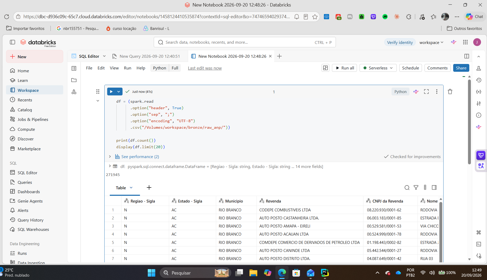

## Ingestão Bronze

Notebook: [`notebooks/00_ingestao_bronze.py`](notebooks/00_ingestao_bronze.py)

A leitura é feita sobre a pasta inteira do Volume, em uma única operação, com
schema explícito declarado todas as 16 colunas como `string`. Três decisões:

**Schema explícito, sem `inferSchema`.** A inferência exigiria uma passada extra
sobre os arquivos e interpretaria mal o preço com vírgula decimal. Mais
importante: com schema fixo, uma mudança de layout na origem **falha de forma
visível** em vez de ser silenciosamente reinterpretada.

**Aplicação posicional do schema.** Com `header=True` e schema declarado, o Spark
descarta a linha de cabeçalho e mapeia por posição o que torna a leitura imune
ao BOM do UTF-8, que de outro modo se anexa ao nome da primeira coluna. Como isso
cria dependência da ordem das colunas, o notebook **valida os seis cabeçalhos
antes de qualquer leitura** e lança exceção se houver divergência.

**Proveniência por linha.** Três colunas de controle são acrescentadas:
`_arquivo_origem` (via `_metadata.file_name`), `_data_ingestao` e `_fonte`. Isso
permite rastrear qualquer registro até o arquivo publicado pela ANP.

Resultado persistido como tabela Delta `workspace.bronze.preco_glp_raw`, com
validação automatizada contra o manifesto:

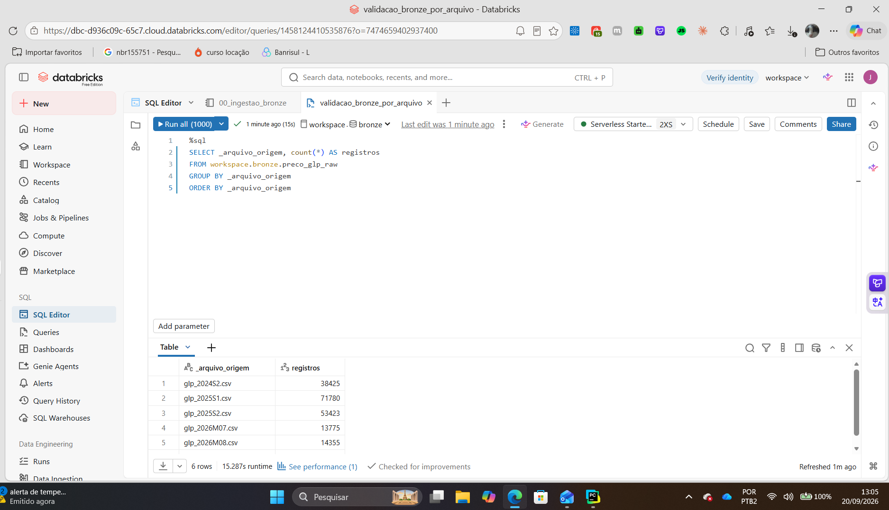

---

# Modelagem e Catálogo de Dados (Etapa 4.3)

## Arquitetura medalhão

A Free Edition do Databricks não permite a criação de catálogos adicionais. A
arquitetura foi implementada como **três schemas dentro do catálogo `workspace`**,
o que preserva integralmente a separação lógica das camadas:

```
workspace
├── bronze
│   ├── raw_anp (Volume)          ← 6 arquivos CSV originais
│   └── preco_glp_raw              ← réplica fiel, tudo em texto
├── silver
│   └── preco_glp_coleta           ← tipada, limpa, enriquecida
└── gold
    ├── fato_coleta_preco          ← fato do esquema estrela
    ├── dim_tempo
    ├── dim_localidade
    ├── dim_revenda
    ├── dim_bandeira
    ├── dim_produto
    ├── agg_indice_p13_nacional    ← agregados analíticos
    ├── agg_preco_capital_mes
    ├── agg_dispersao_municipio_semana
    └── ref_linhas_renda           ← tabela de referência
```

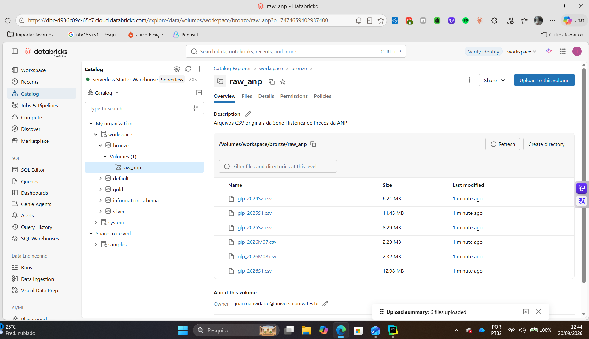

## Por que esquema estrela

A camada Silver é uma tabela ampla: cada linha repete o endereço da revenda, o
nome do município e a bandeira. Isso é adequado para limpeza, mas ruim para
análise pois os dados cadastrais de uma revenda chegam a se repetir em centenas de
linhas.

O esquema estrela separa **o que foi medido** (o preço, no fato) de **o contexto
da medição** (quando, onde, por quem, sob qual marca). Três ganhos concretos
neste trabalho:

1. Consultas analíticas ficam diretas, sem subconsultas para recuperar contexto.
2. Elimina-se redundância nas descrições.
3. Atributos derivados que exigem cálculo como `flag_painel_capitais`, que
   depende de contar meses de cobertura são calculados uma vez, na dimensão, e
   reutilizados por todas as análises.

```
                    dim_tempo
                        │
   dim_bandeira ───┐    │    ┌─── dim_localidade
                   │    │    │
                   └─ fato_coleta_preco ─┐
                   ┌────┘         │      │
        dim_produto              │      └─── dim_revenda
                                 │
                        (valor_venda, valor_compra)
```

### Grão e aditividade

**Grão do fato:** uma coleta de preço, de um produto, em uma revenda, em uma data.

Declarar o grão determina o que pode ser somado. `valor_venda` é um preço,
portanto uma **medida não aditiva**: somar preços de revendas diferentes não
produz nada com significado. Apenas média, mediana e medidas de dispersão fazem
sentido. Essa restrição está registrada no comentário da tabela no Unity Catalog,
para proteger quem venha a consumir o modelo depois.

### Chaves

Cada dimensão recebe uma **chave substituta** (`sk_`) gerada por `row_number`
sobre ordenação determinística, rodar o pipeline duas vezes produz as mesmas
chaves, o que não aconteceria com `monotonically_increasing_id`.

A `dim_localidade` usa **chave natural composta** `(municipio, uf_sigla)`. VALENÇA existe tanto na Bahia quanto no Rio de Janeiro daí a chave natural composta.
São 421 nomes distintos de município mapeiam para 422 localidades.

A `dim_revenda` é de **tipo 1**: atributos cadastrais refletem a última ocorrência
observada, sem versionamento histórico. Decisão consciente o trabalho analisa
preço, não a evolução cadastral das revendas. Uma dimensão tipo 2 seria o
caminho caso o interesse passasse a ser o histórico de mudanças de bandeira.

A `dim_tempo` contém **apenas as datas observadas**, não um calendário completo.
A pesquisa da ANP é semanal; um calendário de 2024-07-01 a 2026-08-31 teria 792
linhas, das quais cerca de 27% nunca se ligariam a fato algum. Dias sem pesquisa
não são informação ausente são dias em que a pesquisa não ocorre.

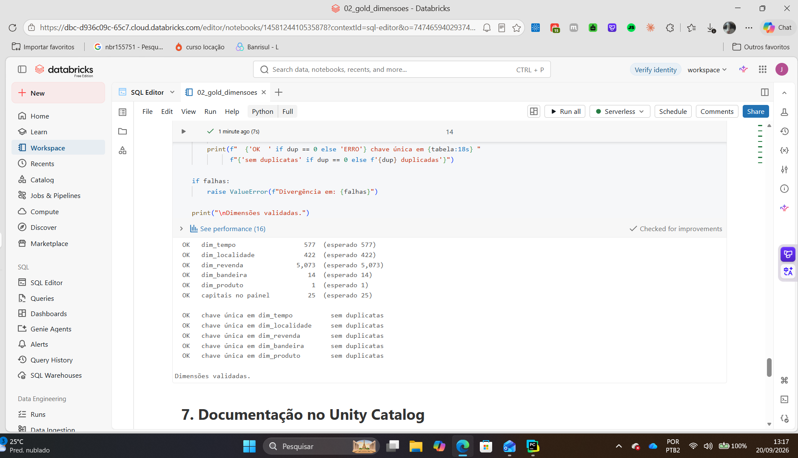

## Catálogo de Dados

O catálogo está implementado no **Unity Catalog**, via `COMMENT ON TABLE` e
`ALTER TABLE ... ALTER COLUMN ... COMMENT`, e transcrito integralmente abaixo. A
documentação vive no sistema, não apenas neste documento quem abrir a tabela no
Catalog Explorer no futuro verá a mesma descrição.

### Evidência do sistema de catálogo

Comentários de coluna aplicados ao fato, visíveis no Catalog Explorer:

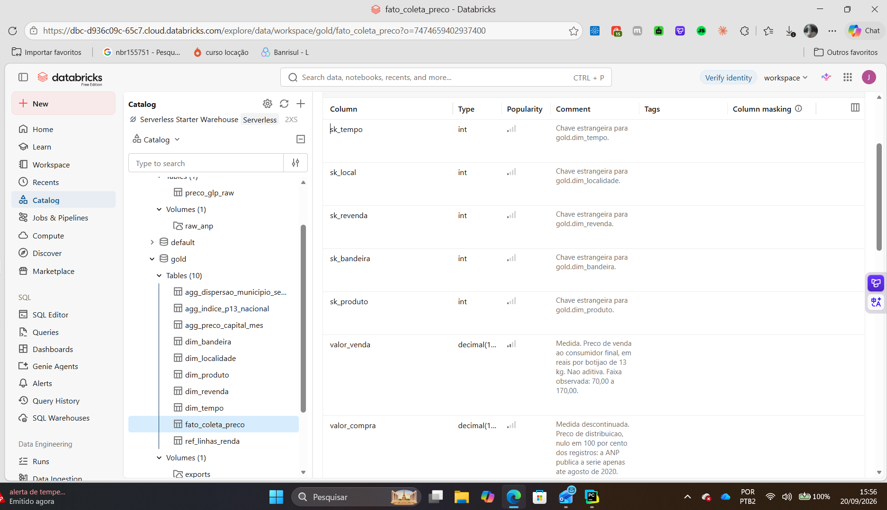

Descrição de tabela e colunas na camada Silver:

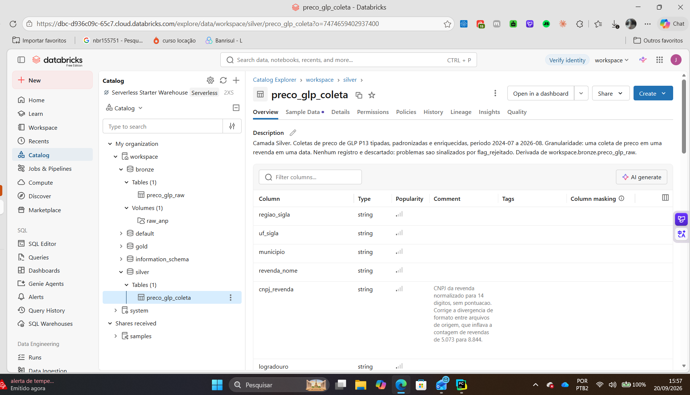

### Linhagem

O Unity Catalog gera a linhagem automaticamente a partir da execução dos
notebooks, em nível de coluna:

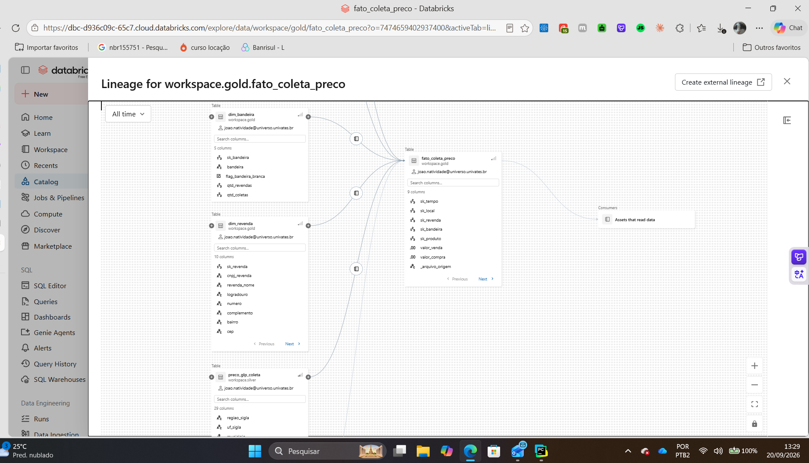

A linhagem é registrada de três formas complementares: neste diagrama, na coluna
de controle `_arquivo_origem` que rastreia cada registro até o arquivo
publicado pela ANP e nos comentários de tabela, que declaram a origem de cada
camada.

---

### `workspace.bronze.preco_glp_raw`

Reprodução da fonte. Todas as colunas em texto bruto e sem tratamento.
**Grão:** uma coleta de preço em uma revenda em uma data. **Linhagem:** carga
direta dos seis CSV do Volume `raw_anp`, sem transformação de valores.
**271.945 linhas, 19 colunas.**

| Coluna | Tipo | Descrição e domínio |
|---|---|---|
| `regiao_sigla` | string | Sigla da região da revenda. Domínio: `N`, `NE`, `CO`, `SE`, `S` |
| `uf_sigla` | string | Sigla da UF. 27 valores distintos |
| `municipio` | string | Município, em caixa alta sem acentos. 421 distintos |
| `revenda_nome` | string | Razão social da revenda. 4.900 distintas |
| `cnpj_revenda` | string | CNPJ. **Formato inconsistente entre arquivos** — ver Qualidade |
| `logradouro` | string | Nome do logradouro |
| `numero` | string | Número do logradouro. Texto: admite `S/N` |
| `complemento` | string | Complemento. 74,1% nulos |
| `bairro` | string | Bairro. 2.729 distintos |
| `cep` | string | CEP no padrão `NNNNN-NNN`. Texto: preserva zeros à esquerda |
| `produto` | string | Combustível. Valor único: `GLP` |
| `data_coleta` | string | Data no formato `dd/MM/yyyy`. 577 datas distintas |
| `valor_venda` | string | Preço ao consumidor, vírgula decimal. Faixa: `70,00` a `170,00` |
| `valor_compra` | string | Preço de distribuição. Nulo em 100% |
| `unidade_medida` | string | Unidade. Valor único: `R$ / 13 kg` |
| `bandeira` | string | Marca comercial exibida, ou `BRANCA`. 14 valores |
| `_arquivo_origem` | string | Controle: arquivo CSV de origem da linha |
| `_data_ingestao` | timestamp | Controle: timestamp da execução da carga |
| `_fonte` | string | Controle: identificação textual da fonte |

---

### `workspace.silver.preco_glp_coleta`

Coletas tipadas, padronizadas e enriquecidas. Nenhum registro é descartado:
problemas são sinalizados por `flag_rejeitado`. **Grão:** idêntico ao Bronze.
**Linhagem:** derivada de `bronze.preco_glp_raw`.
**271.945 linhas, 29 colunas.**

| Coluna | Tipo | Descrição, domínio e transformação |
|---|---|---|
| `regiao_sigla` | string | `trim` + `upper`. Domínio: `N`, `NE`, `CO`, `SE`, `S` |
| `uf_sigla` | string | `trim` + `upper`. 27 valores |
| `municipio` | string | `trim` + `upper`. 421 valores |
| `revenda_nome` | string | `trim` + `upper` |
| `cnpj_revenda` | string | **14 dígitos, sem pontuação.** `regexp_replace` + `lpad`. 5.073 distintos |
| `logradouro` | string | `trim` + `upper` |
| `numero` | string | `trim` + `upper` |
| `complemento` | string | `trim` + `upper`; vazio convertido em nulo |
| `bairro` | string | `trim` + `upper` |
| `cep` | string | Apenas dígitos, 8 posições |
| `produto` | string | `trim` + `upper`. Valor único: `GLP` |
| `data_coleta` | date | `to_date(..., 'dd/MM/yyyy')`. Faixa: 2024-07-01 a 2026-08-31 |
| `valor_venda` | decimal(10,2) | Vírgula → ponto, cast. Faixa: 70,00 a 170,00. Média: 110,93 |
| `valor_compra` | decimal(10,2) | Nulo em registros |
| `unidade_medida` | string | `trim` + `upper`. Valor único: `R$ / 13 KG` |
| `bandeira` | string | `trim` + `upper`. 14 valores; maior é `BRANCA` (63.849 coletas) |
| `ano` | int | Derivado de `data_coleta`. Domínio: 2024, 2025, 2026 |
| `mes` | int | Derivado. Domínio: 1 a 12 |
| `ano_mes` | string | Competência `yyyy-MM`. 26 valores, de `2024-07` a `2026-08` |
| `semana_iso` | int | Semana ISO. Domínio: 1 a 53 |
| `ano_semana` | string | `yyyy-Sww` usando `YEAROFWEEK`, evitando erro na virada do ano |
| `regiao_nome` | string | Região por extenso. Domínio: Norte, Nordeste, Centro-Oeste, Sudeste, Sul |
| `flag_bandeira_branca` | boolean | Verdadeiro quando `bandeira = 'BRANCA'`. 63.849 verdadeiros |
| `flag_capital` | boolean | Verdadeiro quando o município é capital da UF. 27 capitais |
| `flag_rejeitado` | boolean | Verdadeiro se preço nulo/não positivo ou data inválida. **0 ocorrências** |
| `_arquivo_origem` | string | Controle, propagado da Bronze |
| `_data_ingestao` | timestamp | Controle, propagado da Bronze |
| `_fonte` | string | Controle, propagado da Bronze |
| `_data_processamento_silver` | timestamp | Controle: timestamp desta transformação |

---

### `workspace.gold.fato_coleta_preco`

Fato do esquema estrela. **Grão:** uma coleta de preço, de um produto, em uma
revenda, em uma data. **Linhagem:** derivada de `silver.preco_glp_coleta` por
junção com as cinco dimensões. **271.945 linhas, 9 colunas.**

| Coluna | Tipo | Descrição |
|---|---|---|
| `sk_tempo` | int | FK → `dim_tempo`. Domínio: 1 a 577 |
| `sk_local` | int | FK → `dim_localidade`. Domínio: 1 a 422 |
| `sk_revenda` | int | FK → `dim_revenda`. Domínio: 1 a 5.073 |
| `sk_bandeira` | int | FK → `dim_bandeira`. Domínio: 1 a 14 |
| `sk_produto` | int | FK → `dim_produto`. Domínio: 1 |
| `valor_venda` | decimal(10,2) | **Medida não aditiva.** R$ por botijão de 13 kg. Faixa: 70,00 a 170,00 |
| `valor_compra` | decimal(10,2) | Medida descontinuada. Nula em 100% |
| `_arquivo_origem` | string | Controle, propagado desde a Bronze |
| `_data_processamento_gold` | timestamp | Controle: timestamp desta transformação |

---

### `workspace.gold.dim_tempo`

**Grão:** uma data de coleta. **Linhagem:** datas distintas da Silver.
**577 linhas, 9 colunas.**

| Coluna | Tipo | Descrição e domínio |
|---|---|---|
| `sk_tempo` | int | Chave substituta. 1 a 577 |
| `data_coleta` | date | Chave natural. 2024-07-01 a 2026-08-31 |
| `ano` | int | 2024, 2025, 2026 |
| `trimestre` | int | 1 a 4 |
| `mes` | int | 1 a 12 |
| `ano_mes` | string | `yyyy-MM`. 26 valores |
| `semana_iso` | int | 1 a 53 |
| `ano_semana` | string | `yyyy-Sww` |
| `dia_semana` | string | Nome do dia da semana |

---

### `workspace.gold.dim_localidade`

**Grão:** um município. **Chave natural composta:** `(municipio, uf_sigla)`.
**Linhagem:** agregação da Silver por município, com derivação dos atributos de
cobertura. **422 linhas, 10 colunas.**

| Coluna | Tipo | Descrição e domínio |
|---|---|---|
| `sk_local` | int | Chave substituta. 1 a 422 |
| `municipio` | string | Parte da chave natural. 421 nomes distintos |
| `uf_sigla` | string | Parte da chave natural. 27 valores |
| `regiao_sigla` | string | `N`, `NE`, `CO`, `SE`, `S` |
| `regiao_nome` | string | Norte, Nordeste, Centro-Oeste, Sudeste, Sul |
| `qtd_revendas_pesquisadas` | long | Revendas distintas no município. **Proxy de concorrência local.** 1 a 198 |
| `qtd_coletas` | long | Total de coletas no município na série |
| `meses_com_coleta` | long | Meses dos 26 em que houve coleta. **1 a 26** a abrangência da pesquisa mudou |
| `flag_capital` | boolean | Verdadeiro para capital de UF. 27 verdadeiros |
| `flag_painel_capitais` | boolean | Capital com cobertura nos 26 meses. **25 verdadeiros** critério objetivo do painel balanceado |

---

### `workspace.gold.dim_revenda`

**Grão:** um CNPJ. **Tipo 1** (sobrescreve, sem histórico). **Linhagem:** última
ocorrência observada de cada CNPJ na Silver. **5.073 linhas, 10 colunas.**

| Coluna | Tipo | Descrição |
|---|---|---|
| `sk_revenda` | int | Chave substituta. 1 a 5.073 |
| `cnpj_revenda` | string | Chave natural. 14 dígitos normalizados |
| `revenda_nome` | string | Razão social, última observada |
| `logradouro` | string | Logradouro |
| `numero` | string | Número; admite `S/N` |
| `complemento` | string | Complemento; nulo na maioria |
| `bairro` | string | Bairro |
| `cep` | string | CEP, 8 dígitos |
| `municipio` | string | Município da revenda |
| `uf_sigla` | string | UF da revenda |

---

### `workspace.gold.dim_bandeira`

**Grão:** uma bandeira. **Linhagem:** valores distintos de `bandeira` na Silver.
**14 linhas, 5 colunas.**

| Coluna | Tipo | Descrição |
|---|---|---|
| `sk_bandeira` | int | Chave substituta. 1 a 14 |
| `bandeira` | string | Chave natural. Marca da distribuidora ou `BRANCA` |
| `flag_bandeira_branca` | boolean | Verdadeiro para `BRANCA`. 1 verdadeiro |
| `qtd_revendas` | long | Revendas distintas sob a bandeira. 1 a 1.389 |
| `qtd_coletas` | long | Coletas sob a bandeira. 1 a 63.849 |

Domínio completo: `BRANCA` (63.849 coletas), `SUPERGASBRAS ENERGIA` (39.729),
`ULTRAGAZ` (38.779), `NACIONAL GÁS BUTANO` (37.477), `LIQUIGÁS` (30.971),
`COPA ENERGIA` (17.795), `BAHIANA` (13.985), `FOGAS` (13.929), `CONSIGAZ` (8.066),
`AMAZONGÁS` (4.741), `MINASGAS` (2.213), `NGC DISTRIBUIDORA` (240),
`SERVGÁS` (170), `GLPGAS` (1).

---

### `workspace.gold.dim_produto`

**Grão:** produto e unidade de medida. **Linhagem:** valores distintos na Silver.
**1 linha, 4 colunas.** Existe por integridade do esquema e como ponto de
extensão: a ANP publica gasolina, etanol, diesel e GNV no mesmo layout.

| Coluna | Tipo | Descrição |
|---|---|---|
| `sk_produto` | int | Chave substituta. Valor: 1 |
| `produto` | string | Chave natural. Valor: `GLP` |
| `unidade_medida` | string | Parte da chave natural. Valor: `R$ / 13 KG` |
| `qtd_coletas` | long | Coletas do produto. 271.945 |

---

### `workspace.gold.agg_preco_capital_mes`

Agregado analítico. **Grão:** mês × capital do painel balanceado.
**Sem ponderação:** cada capital é uma observação. **Linhagem:** agregação do
fato restrita a `flag_painel_capitais`. **650 linhas** (25 capitais × 26 meses),
**13 colunas.**

| Coluna | Tipo | Descrição |
|---|---|---|
| `ano_mes` | string | Competência. 26 valores |
| `municipio` | string | Capital. 25 valores |
| `uf_sigla` | string | UF da capital |
| `regiao_nome` | string | Região da capital |
| `preco_medio` | decimal | Preço médio da capital no mês. 93,60 a 138,23 no período |
| `preco_mediano` | decimal | Mediana do mês |
| `preco_min` | decimal | Menor preço do mês na capital |
| `preco_max` | decimal | Maior preço do mês na capital |
| `coletas` | long | Coletas no mês |
| `revendas` | long | Revendas distintas no mês |
| `pct_linha_extrema_pobreza` | double | Preço como % de R$ 109/pessoa/mês. Linha de elegibilidade, não renda observada |
| `pct_linha_pobreza` | double | Preço como % de R$ 218/pessoa/mês |
| `pct_piso_bolsa_familia` | double | Preço como % de R$ 600/família/mês |

---

### `workspace.gold.agg_indice_p13_nacional`

Índice de preço do botijão P13, base julho/2024 = 100. Calculado em **dois
passos**  média por capital, depois média entre capitais com peso igual sobre
o painel balanceado. Índice não oficial, construído por este MVP, inspirado na
metodologia de cesto fixo dos índices de preço tradicionais.
**Linhagem:** derivado de `agg_preco_capital_mes`. **26 linhas, 9 colunas.**

| Coluna | Tipo | Descrição |
|---|---|---|
| `ano_mes` | string | Competência. 26 valores |
| `capitais` | long | Capitais no painel. Constante: 25 |
| `coletas` | long | Coletas do painel no mês |
| `preco_medio_painel` | decimal | Média simples entre as 25 capitais. 104,97 a 116,80 |
| `indice_base_100` | double | Índice. 100,00 a 111,27 |
| `variacao_mensal_pct` | double | Variação sobre o mês anterior. −0,39% a +2,64% |
| `variacao_acumulada_pct` | double | Variação sobre a base. 0,00% a 11,27% |
| `pct_linha_extrema_pobreza` | double | 96,3% a 107,2% |
| `pct_piso_bolsa_familia` | double | 17,5% a 19,5% |

---

### `workspace.gold.agg_dispersao_municipio_semana`

**Grão:** município × semana ISO, restrito a grupos com ao menos 5 coletas.
Mede a dispersão entre revendas da mesma cidade na mesma semana.
**Linhagem:** agregação do fato por município e semana. **24.645 linhas, 12 colunas.**

| Coluna | Tipo | Descrição |
|---|---|---|
| `municipio` | string | Município |
| `uf_sigla` | string | UF |
| `regiao_nome` | string | Região |
| `ano_semana` | string | Semana ISO, `yyyy-Sww` |
| `coletas` | long | Coletas no grupo. Mínimo 5 por construção |
| `preco_medio` | decimal | Média do grupo |
| `desvio_padrao` | decimal | Desvio-padrão do grupo |
| `preco_min` | decimal | Menor preço do grupo |
| `preco_max` | decimal | Maior preço do grupo |
| `coef_variacao_pct` | double | Desvio / média. Mediana 5,1%, p90 9,2% |
| `spread_pct` | double | (max/min − 1). Mediana 16,2%, p90 33,3% |
| `economia_rs` | decimal | Média − mínimo. **Quanto se economiza comprando no mais barato.** Mediana R$ 7,86 |

---

### `workspace.gold.ref_linhas_renda`

Tabela de referência com constantes públicas. **Obs:** são critérios de
elegibilidade de programas sociais, não renda observada da população. Todos
os valores estiveram vigentes durante todo o período analisado. **4 colunas.**

| `referencia` | `valor_mensal` | `unidade` |
|---|---:|---|
| `linha_extrema_pobreza` | R$ 109,00 | pessoa |
| `linha_pobreza` | R$ 218,00 | pessoa |
| `piso_bolsa_familia` | R$ 600,00 | família |

---

# Pipeline de Dados (Etapa 4.4)

## Organização em notebooks

O pipeline foi **ramificado em sete notebooks**, em vez de concentrado em um só.
O critério de divisão foi a responsabilidade: cada notebook tem uma entrada, uma
saída e um conjunto próprio de validações.

| Notebook | Entrada | Saída | Responsabilidade |
|---|---|---|---|
| `00_ingestao_bronze` | Volume `raw_anp` | `bronze.preco_glp_raw` | Replicar a fonte sem alterá-la |
| `01_bronze_para_silver` | Bronze | `silver.preco_glp_coleta` | Tipar, padronizar, enriquecer |
| `02_gold_dimensoes` | Silver | 5 dimensões | Construir o contexto |
| `03_gold_fato` | Silver + dimensões | `fato_coleta_preco` | Construir o fato e verificar integridade |
| `04_qualidade_dados` | Bronze | (nada) | Perfilar e medir defeitos |
| `05_gold_agregados` | Fato + dimensões | 3 agregados + referência | Materializar métricas analíticas |
| `06_analise_perguntas` | Gold | (nada) | Responder as perguntas de negócio |
| `07_exportar_resultados` | Gold | Volume `exports` | Consolidar resultados para documentação |

A ramificação tem três vantagens práticas. Falhas ficam localizadas se a
validação da Silver acusa divergência, não é necessário reexecutar a ingestão.
Cada notebook pode ser reexecutado isoladamente, já que todos são idempotentes
(`mode("overwrite")`). E a leitura do repositório fica compreensível para quem
não acompanhou a construção.

O `04_qualidade_dados` é o único que não escreve nada. Ele lê a camada
Bronze deliberadamente, porque qualidade se mede no estado bruto. Perfilar a
Silver seria medir o próprio conserto e concluir que não havia problema.

## Fluxo de transformação

```
6 CSV (ANP)
    │  coleta_anp_glp.py — download + SHA-256 + manifesto
    ▼
Volume workspace.bronze.raw_anp
    │  00 — schema explícito em texto, validação de cabeçalho, proveniência
    ▼
bronze.preco_glp_raw ─────────────┐
    │  01 — tipagem, trim/upper,  │  04 — perfilagem de qualidade
    │       normalização de CNPJ, │      (somente leitura)
    │       derivações temporais  │
    ▼                             │
silver.preco_glp_coleta           │
    │                             │
    ├─── 02 ──► 5 dimensões       │
    │                             │
    └─── 03 ──► fato_coleta_preco ◄┘
                    │
                    │  05 — agregação
                    ▼
        3 agregados + ref_linhas_renda
                    │
                    │  06 — análise │ 07 — exportação
                    ▼
            respostas de negócio
```

## Principais transformações

**Normalização do CNPJ (Silver).** `regexp_replace` para dígitos + `lpad` a 14
posições. Corrige a divergência de formato entre arquivos de origem. Sem esta
transformação a `dim_revenda` teria 8.844 linhas em vez de 5.073 e inflação de
74% na contagem de estabelecimentos.

**Padronização de texto (Silver).** `trim` + `upper` em todos os campos
alfanuméricos, com conversão de string vazia em nulo. Evita que `' XEREM'` e
`'XEREM'` sejam tratados como bairros diferentes.

**Tipagem (Silver).** Vírgula decimal substituída por ponto e cast para
`decimal(10,2)`; data convertida com máscara explícita `dd/MM/yyyy`. Após a
conversão: 0 preços não numéricos e 0 datas inválidas.

**Junções do fato (Gold).** Todos os joins são `inner`, deliberadamente. Um
`left join` preencheria chave ausente com nulo e o pipeline seguiria com dados
quebrados; o `inner` faz a linha desaparecer, e a checagem de contagem detecta o
sumiço imediatamente. Prefere-se falhar alto a seguir em silêncio.

**Painel balanceado (Gold).** `flag_painel_capitais` marca as capitais presentes
nos 26 meses  (25 das 27 qualificam). É a resposta modelada ao problema de
cobertura amostral variável descrito na seção de Qualidade.

**Índice em dois passos (Gold).** Média por capital, depois média entre capitais.
Uma média direta sobre o fato daria a Manaus (7.547 coletas) peso doze vezes
maior que a Florianópolis (609). Ponderando pela intensidade da pesquisa, que é
exatamente a variável instável que o painel existe para neutralizar.

## Validação automatizada

Cada notebook termina com um bloco de checagens que compara os resultados contra
uma **implementação de referência** desenvolvida em pandas e executada localmente
([`referencia_pipeline_glp.py`](referencia_pipeline_glp.py)). Divergência lança
exceção e interrompe a execução.

| Notebook | Checagens |
|---|---:|
| [`00_ingestao_bronze`](notebooks/00_ingestao_bronze.py)| 7 (total + 6 arquivos) |
| [`01_bronze_para_silver`](notebooks/01_bronze_para_silver.py) | 7 |
| [`02_gold_dimensoes`](notebooks/02_gold_dimensoes.py) | 11 (6 contagens + 5 testes de unicidade) |
| [`03_gold_fato`](notebooks/03_gold_fato.py) | 12 (contagem, nulos, integridade referencial, soma de controle) |
| [`04_qualidade_dados`](notebooks/04_qualidade_dados.py) | 10 |
| [`05_gold_agregados`](notebooks/05_gold_agregados.py) | 8 |
| [`06_analise_perguntas`](notebooks/06_analise_perguntas.py) | 10 |
| **Total** | **65** |

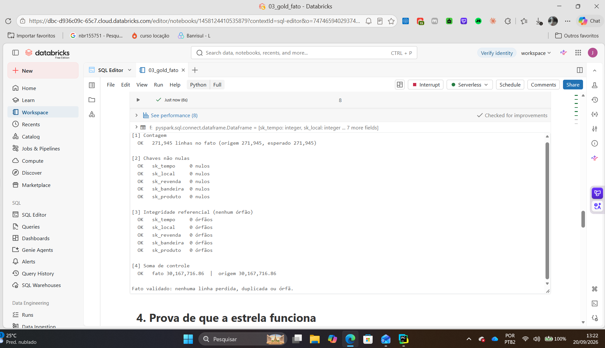

A validação do fato merece destaque por incluir uma **soma de controle**: o total
de `valor_venda` antes e depois das junções deve ser idêntico. Contagem igual não
garante linhas iguais poderia ter perdido uma e duplicado outra. A soma fecha
essa brecha. Resultado: R$ 30.167.716,86 nos dois lados.


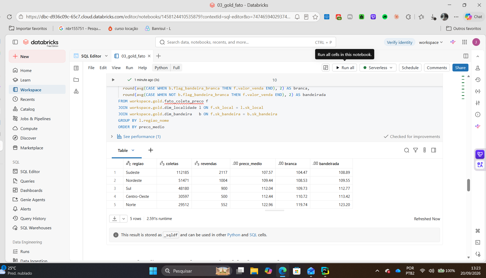

## Evidência de persistência

Todas as tabelas são Delta, persistidas no Unity Catalog:

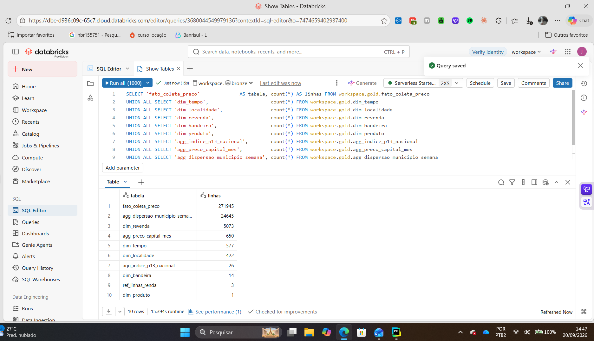

## Integração com Git

Os notebooks foram exportados do Databricks em formato *source* e versionados
neste repositório. A plataforma oferece integração direta via Databricks Repos,
não utilizada aqui por exigir configuração de token de acesso e a exportação
manual atende ao requisito com menos superfície de configuração.

---

# Qualidade de Dados (Etapa 4.5)

A verificação foi executada sobre a camada **Bronze**, antes de qualquer
transformação, para que os defeitos fossem medidos no estado em que chegaram da
fonte. Cada atributo foi perfilado em cinco dimensões: completude, consistência,
unicidade, acurácia e outliers. Os tratamentos foram aplicados na camada Silver.

Notebook: [`04_qualidade_dados`](notebooks/04_qualidade_dados.py)

## Resumo dos problemas detectados

| # | Problema | Magnitude | Tratamento | Camada |
|---|---|---|---|---|
| 1 | CNPJ com formato divergente entre arquivos | 271.945 linhas (100%) | Normalização para 14 dígitos | Silver |
| 2 | Espaços nas bordas de campos de texto | 219.558 ocorrências | `trim` + `upper` | Silver |
| 3 | `Valor de Compra` sem dados | 271.945 nulos (100%) | Mantida nula e documentada | Bronze → Silver |
| 4 | `Complemento` majoritariamente ausente | 74,1% nulos + 199 só com espaços | Espaços convertidos em nulo | Silver |
| 5 | BOM UTF-8 no cabeçalho | 1ª coluna de cada arquivo | Schema posicional | Bronze |
| 6 | Formatos brasileiros de número e data | 100% das linhas | Cast explícito | Silver |
| 7 | Cobertura da amostra variável no tempo | 94 a 411 municípios/mês | Painel balanceado | Gold |
| 8 | Outliers de preço | 269 registros (0,10%) | Mantidos, com justificativa | — |

## 1. Inconsistência de formato no CNPJ

**Detecção.** O arquivo `glp_2025S2.csv` publica o CNPJ sem formatação
(`02977286000195`) em 100% das suas 53.423 linhas. Os outros cinco publicam o
valor formatado e com espaço à esquerda (`' 08.220.930/0001-62'`), em 218.522
linhas. As duas contagens somam exatamente os 271.945 registros.

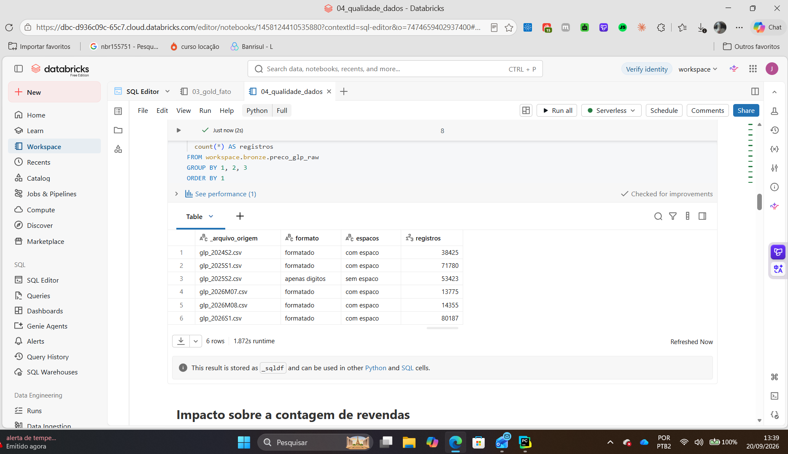

**Impacto.** O CNPJ é a chave natural da entidade "revenda". Com dois formatos
concorrentes, o mesmo estabelecimento passa a existir como duas entidades
distintas conforme o semestre em que foi pesquisado:

| Contagem de CNPJs distintos | Valor |
|---|---:|
| Bronze, sobre a string crua | 8.844 |
| Após normalização | **5.073** |
| Entidades duplicadas eliminadas | 3.771 (**42,6%**) |

Sem correção, a dimensão de revendas teria 74% mais linhas do que revendas reais,
e toda métrica derivada de contagem de estabelecimentos inclusive o indicador
de concorrência local usado na pergunta 4 ficaria inflada especificamente no
2º semestre de 2025.

**Tratamento.** Na Silver, o campo é reduzido a dígitos e preenchido à esquerda
com zeros até 14 posições:

```python
F.lpad(F.regexp_replace(F.col("cnpj_revenda"), r"\D", ""), 14, "0")
```

## 2. Espaços nas bordas de campos de texto

**Detecção.** Cinco campos: `CNPJ da Revenda` (218.522 linhas, 80,4%),
`Nome da Rua` (699), `Revenda` (64), `Complemento` (251) e `Bairro` (22).

**Impacto.** Em agrupamentos por texto, `' XEREM'` e `'XEREM'` são chaves
diferentes, fragmentando agregações por bairro e por nome de revenda.

**Tratamento.** `trim` seguido de `upper` em todos os campos alfanuméricos da
Silver, padronizando também a caixa.

## 3. `Valor de Compra` descontinuado na fonte

**Detecção.** A coluna existe no layout mas vem vazia em **todos** os 271.945
registros. Os metadados oficiais da ANP confirmam a causa: o campo corresponde
ao preço de distribuição e sua *série está disponível apenas até agosto de 2020*.

**Impacto.** Inviabiliza o cálculo da margem bruta da revenda, objeto da pergunta
de negócio 7.

**Tratamento.** A coluna é preservada na Bronze por fidelidade à fonte e mantida
na Silver e no fato com tipo `decimal(10,2)` e valor nulo. No catálogo de dados
sua descrição registra a descontinuidade, para que consumidores futuros não a
interpretem como falha de carga.

## 4. `Complemento` majoritariamente ausente

**Detecção.** 74,1% de nulos (201.513 de 271.945). Além disso, 199 linhas contêm
apenas caracteres de espaço não nulos para o parser, mas vazios semanticamente.

**Tratamento.** Após o `trim`, strings vazias são convertidas em nulo, unificando
as duas representações de ausência.

## 5. Byte Order Mark no cabeçalho

**Detecção.** Os arquivos são UTF-8 **com BOM**. O marcador (`\ufeff`) fica
anexado ao nome da primeira coluna, que passa a ser lido como
`\ufeffRegiao - Sigla`.

**Impacto.** Qualquer referência a `Regiao - Sigla` falha silenciosamente ou
lança erro de coluna inexistente.

**Tratamento.** Schema explícito aplicado por posição, o que torna a leitura
independente dos nomes no cabeçalho.


## 6. Formatos brasileiros de número e data

**Detecção.** `Valor de Venda` usa vírgula decimal (`"125,00"`) e
`Data da Coleta` o formato `dd/MM/yyyy`.

**Tratamento.** A Bronze declara todas as colunas como `string`, sem
`inferSchema`  assim uma mudança de layout na fonte falha de forma visível. A
conversão ocorre na Silver. Após o cast: 0 preços não numéricos e 0 datas
inválidas.

## 7. Cobertura da amostra variável ao longo do tempo

**Detecção.** O número de municípios pesquisados por mês vai de 95 (jul/2024) a
411 (2026), com colapso intermediário para 94 em ago/2025. A pesquisa da ANP foi
expandida por fases, com interrupções.

**Impacto.** Defeito de comparabilidade, não de conteúdo. A média nacional
simples mistura variação de preço com variação de composição da amostra. O caso
mais claro é janeiro de 2025: a média bruta **cai** de BRL 108,93 para BRL 107,68
exatamente quando os municípios saltam de 95 para 164. No painel de capitais o
mesmo mês fica estável (BRL 109,72 para BRL 109,66). A queda era entrada de
municípios baratos na amostra, não barateamento.

**Tratamento.** Construção, na camada Gold, de um painel balanceado com as
capitais presentes em todos os 26 meses (25 das 27 qualificaram); Macapá e Palmas
ficaram de fora com 25 meses cada. Metodologia inspirada nos índices de cesto
fixo: as sete capitais do componente IPC do IGP-M não
incluem nenhuma do Norte e reduziriam a amplitude regional medida de 47,7% para
cerca de 31%.

**Validação.** A variação acumulada de 26 meses é de +11,04% na série bruta e
+10,50% no painel. A proximidade indica que a tendência de longo prazo é robusta
à composição; a divergência mês a mês mostra que as leituras individuais não são.

## 8. Outliers de preço

**Detecção.** Pelo critério de Tukey (1,5 × IQR sobre os limites
[BRL 70,00; BRL 150,00]), 269 registros ficam fora da faixa ou 0,1% da base. Mínimo
observado BRL 70,00, máximo R$ 170,00.

**Mantido.** Ambos os extremos são preços plausíveis para um botijão de
13 kg no período, e a amplitude regional confirmada pela análise (Recife
BRL 93,60; Boa Vista R$ 138,23) mostra que valores altos refletem desafios de geografia. Remover esses registros eliminaria justamente o sinal que o
trabalho se propõe a medir.

## Verificações realizadas sem problemas encontrados

A base da ANP é curada, e parte das checagens retornou negativo. Os testes foram
executados e seus resultados registrados:

| Verificação | Resultado |
|---|---|
| Unicidade (CNPJ + data + produto) | **0** linhas em chave duplicada |
| Datas fora do formato `dd/MM/yyyy` | 0 |
| `Valor de Venda` nulo ou ≤ 0 | 0 |
| CEP fora do padrão `NNNNN-NNN` | 0 |
| Domínio de `Produto` | valor único: `GLP` |
| Domínio de `Unidade de Medida` | valor único: `R$ / 13 kg` |
| Divergência de esquema entre os 6 arquivos | nenhuma: 16 colunas idênticas, mesma ordem |
| Cobertura de UFs | 27 de 27 |

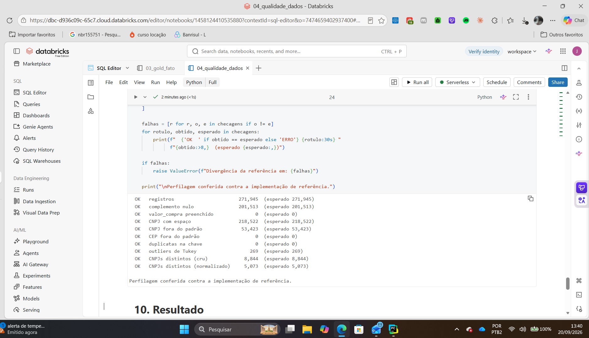

## Como os problemas foram considerados na modelagem e no pipeline

| Problema | Decisão de projeto |
|---|---|
| 1, 2 | `dim_revenda` tem como chave natural o CNPJ já normalizado; sem isso teria 8.844 linhas em vez de 5.073 |
| 3 | `valor_compra` permanece no fato, com descontinuidade descrita no Unity Catalog |
| 5, 6 | Bronze declara schema explícito, todo em `string`, para que mudanças na fonte falhem de forma visível |
| 7 | `dim_localidade` recebe `flag_capital` e `flag_painel_capitais`, que sustentam `agg_indice_p13_nacional` e `agg_preco_capital_mes` |
| 8 | Nenhum registro descartado por valor; a Silver marca `flag_rejeitado` em vez de excluir |

Nenhuma linha é descartada silenciosamente em etapa alguma: os 271.945 registros
da Bronze chegam integralmente ao fato, e a soma de controle ao final do pipeline
confirma a igualdade.

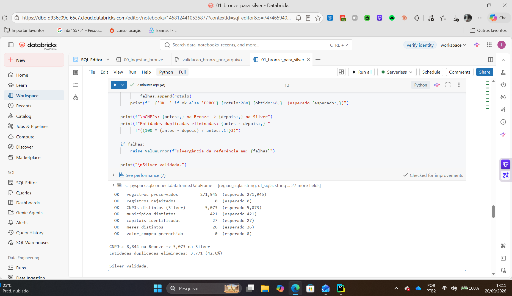

---

# Análise de Dados (Etapa 4.5)

Todas as consultas rodaram sobre o esquema estrela e os agregados da camada Gold.
Código em [`06_analise_perguntas`](notebooks/06_analise_perguntas.py);
resultados consolidados em
[`resultados_analise_glp.xlsx`](docs/resultados_analise_glp.xlsx).

## Dois controles aplicados a todas as respostas

**Comparação dentro do mesmo contexto.** Uma média simples de bandeira branca
contra bandeirada compara revendas de municípios diferentes. Se as brancas se
concentram em cidades baratas, o desconto aparente é geografia disfarçada de
bandeira. Toda comparação de bandeira é pareada dentro do mesmo município e mês.

**Neutralização da composição amostral.** Toda análise temporal e toda comparação
de nível entre regiões usam o painel balanceado de 25 capitais.

## Distinção que organiza os resultados

| Tipo de dispersão | A família pode agir? | Perguntas |
|---|---|---|
| **Acionável** — entre revendas da mesma cidade | Sim | 2, 3, 4 |
| **Estrutural** — entre regiões e ao longo do tempo | Não | 1, 5, 6 |

## Pergunta 1 — Diferença de preço entre regiões e UFs

Cada região é representada pela média de suas capitais no painel, não pela média
das coletas caso contrário Manaus, com 7.547 coletas, dominaria o Norte.

| Região | Capitais | Preço médio | vs. Sudeste |
|---|---:|---:|---:|
| Sudeste | 4 | R$ 104,32 | — |
| Nordeste | 9 | R$ 107,41 | +3,0% |
| Centro-Oeste | 4 | R$ 110,07 | +5,5% |
| Sul | 3 | R$ 113,86 | +9,1% |
| Norte | 5 | R$ 123,74 | **+18,6%** |

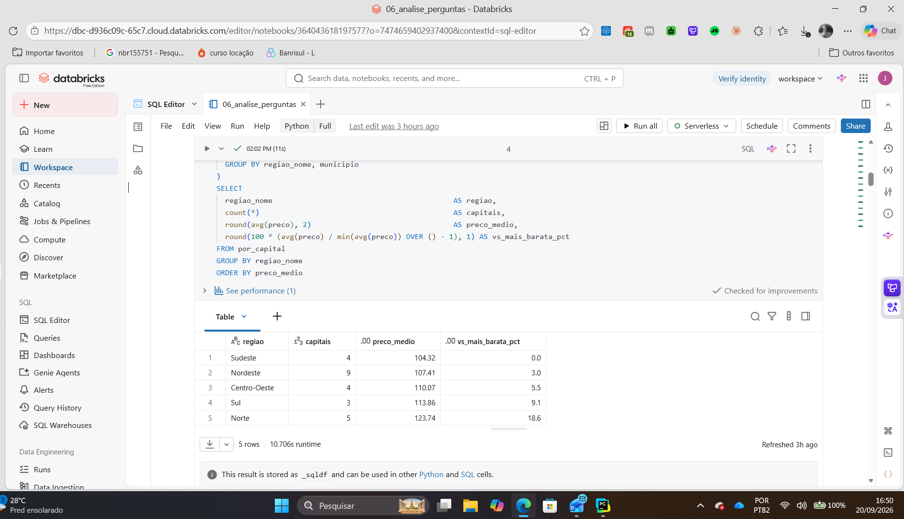

Entre capitais, a amplitude é de **47,7%**: Recife a BRL 93,60 e Boa Vista a
BRL 138,23 — **R$ 44,63 de diferença pelo mesmo botijão de 13 kg**.

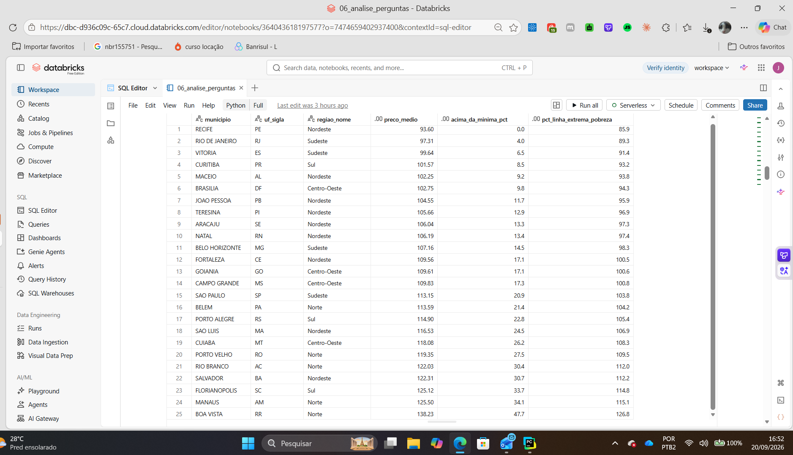

**A hierarquia é  estável.** Comparando os seis primeiros meses com
os seis últimos, a ordem entre regiões não muda: correlação de postos de Spearman
igual a **1**.

| Região | Primeiros 6 meses | Últimos 6 meses | Variação |
|---|---:|---:|---------:|
| Sudeste | R$ 102,35 | R$ 107,51 |    +5,0% |
| Nordeste | R$ 102,85 | R$ 112,52 |    +9,4% |
| Centro-Oeste | R$ 106,79 | R$ 114,99 |    +7,7% |
| Sul | R$ 110,23 | R$ 118,25 |    +7,3% |
| Norte | R$ 120,88 | R$ 126,92 |    +5,0% |

**Discussão.** A ordenação se manteve intacta em dois anos, mas os aumentos foram
desiguais: o Nordeste subiu quase o dobro do Sudeste e do Norte. Como partia da
segunda posição mais barata, o movimento comprime a distância para o
Centro-Oeste sem alterar a ordem. A estabilidade sugere que o gradiente regional
é determinado por fatores estruturais, distância das centrais de distribuição,
custo logístico, densidade da malha de revendas e não por oscilações
conjunturais.

Um caso destoa: **Florianópolis (R$ 125,12) é a segunda capital mais cara do
país**, num Sul de resto intermediário, superando todas as capitais do Nordeste e
do Centro-Oeste. Os dados disponíveis não explicam a anomalia.

## Pergunta 2 — Dispersão dentro da mesma cidade e semana

Este é o ruído acionável. São 24.645 grupos município-semana com ao menos 5
coletas, abaixo disso o coeficiente de variação é instável demais.

| Métrica | Mediana | P90 |
|---|---:|---:|
| Coeficiente de variação | 5,1% | 9,2% |
| Spread entre maior e menor preço | 16,2% | 33,3% |
| Economia vs. preço médio | **R$ 7,86** | R$ 15,25 |

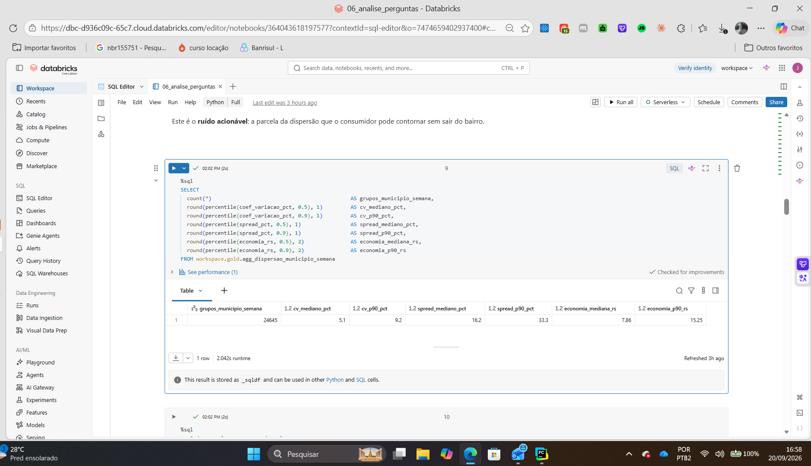

Na cidade mediana, numa semana qualquer, a revenda mais cara cobra 16,2% a mais
que a mais barata. Comprar na mais barata em vez de pagar a média economiza
**R$ 7,86**, cerca de 7% do botijão.

| Região | Spread mediano | Economia mediana |
|---|---:|---:|
| Centro-Oeste | 20,4% | **R$ 10,00** |
| Norte | 16,0% | R$ 8,22 |
| Sudeste | 18,0% | R$ 8,15 |
| Sul | 14,9% | R$ 7,21 |
| Nordeste | 13,0% | R$ 6,67 |

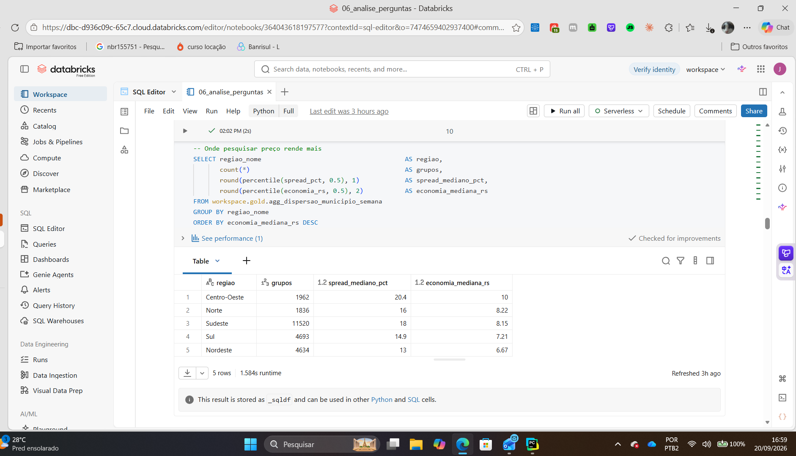

Nos municípios de maior dispersão o efeito é bem maior: Cianorte (PR) com spread
médio de 41,4% e BRL 21,50 de economia; Cuiabá, 43,6% e BRL 19,20; São Paulo,
42,7% e R$ 18,64.

**Discussão.** Comparando com a pergunta 1, o resultado é contraintuitivo:
pesquisar preço dentro do próprio bairro rende quase um quinto do que separa a
capital mais cara da mais barata do país  (`R$ 7,86 contra R$ 44,63`). A diferença é
que a primeira está ao alcance de um `Google` e a segunda não está ao alcance
de ninguém.

## Pergunta 3 — Bandeira branca é mais barata?

Comparação pareada: apenas municípios-mês onde os dois tipos coexistem. São 5.632
pares.

| Métrica | Valor |
|---|---:|
| Diferença média (branca − bandeirada) | **−R$ 1,65** |
| Diferença mediana | −R$ 1,25 |
| Diferença percentual | −1,5% |
| Pares em que a branca é mais barata | 61,3% |

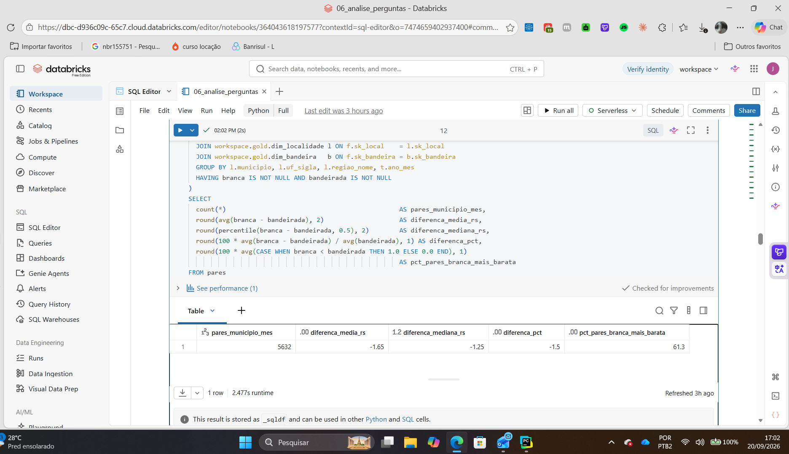

O efeito médio é modesto, mas esconde heterogeneidade regional marcante:

| Região | Pares | Diferença média | % de pares com branca mais barata |
|---|---:|---:|---:|
| Sul | 1.111 | −R$ 2,34 | 67,9% |
| Sudeste | 2.877 | −R$ 2,17 | 65,7% |
| Centro-Oeste | 489 | −R$ 1,17 | 63,0% |
| Norte | 320 | −R$ 0,11 | **45,0%** |
| Nordeste | 835 | **+R$ 0,21** | **42,5%** |

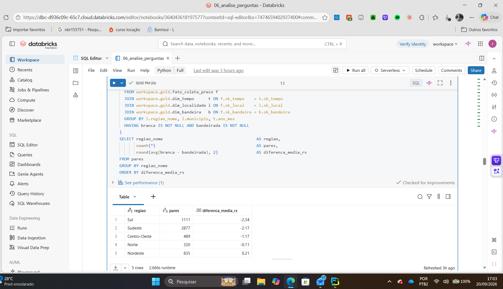

**Discussão.** O desconto existe no Sul, Sudeste e Centro-Oeste, desaparece no
Norte e inverte no Nordeste. As duas métricas confirmam o padrão de forma
independente: nas duas regiões onde a diferença média some, a proporção de pares
com branca mais barata cai abaixo de 50%.

Uma tese que os dados não permitem confirmar é que a
bandeira branca desconta onde há distribuidoras concorrendo pela revenda, e perde
essa vantagem onde a estrutura de distribuição é mais concentrada. Verificar isso
exigiria dados de participação de mercado por região, fora do escopo desta base.

Registre-se que **a bandeira branca é a maior categoria isolada do país**: 1.389
revendas e 63.849 coletas, 23,5% do total, à frente de Supergasbras, Ultragaz e
Nacional Gás.

## Pergunta 4 — Concorrência local e preço

Analisados os 414 municípios pesquisados em 2026 com ao menos 3 revendas. Correlação de Spearman, sobre postos, porque a relação não
precisa ser linear para existir.

**No agregado nacional não há relação: ρ = −0,07.** E as faixas não são
monotônicas:

| Faixa de revendas | Municípios | Preço médio |
|---|---:|---:|
| menos de 6 | 43 | R$ 116,18 |
| de 6 a 10 | 283 | R$ 113,66 |
| de 11 a 20 | 65 | R$ 112,24 |
| 21 ou mais | 23 | **R$ 115,92** |

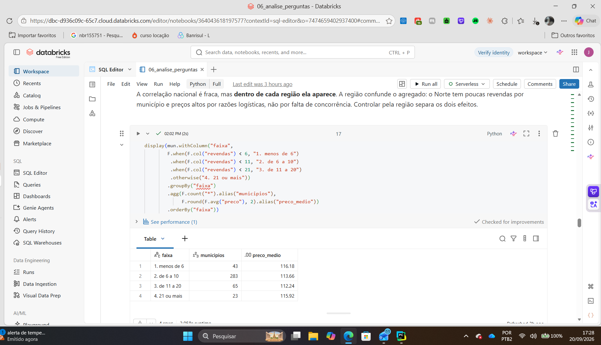

A explicação está na composição da faixa superior: municípios com mais de 21
revendas são quase todos capitais, várias caras por razões logísticas com Manaus
(79 revendas, BRL 126,97), Boa Vista (25, BRL 141,98), Cuiabá (27, R$ 122,70). A
região confunde o agregado.

Controlando por região, a relação aparece em todas elas:

| Região | Municípios | Spearman |
|---|---:|---:|
| Centro-Oeste | 29 | **−0,347** |
| Sul | 77 | −0,217 |
| Nordeste | 89 | −0,211 |
| Norte | 30 | −0,142 |
| Sudeste | 189 | −0,061 |

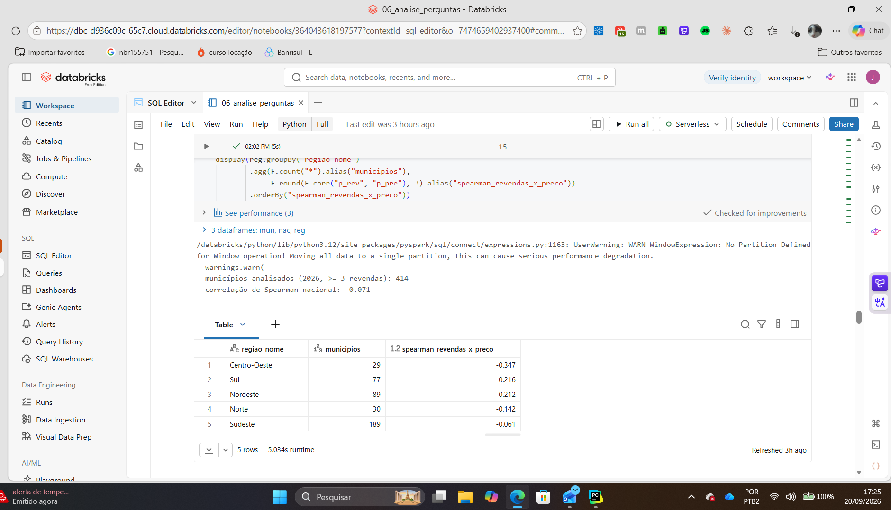

**Discussão.** A resposta é condicional: **dentro de uma mesma região, mais
revendas está associado a preço menor; entre regiões, não.** Afirmar simplesmente
que concorrência reduz preço seria contrariado pela própria tabela de faixas.

O resultado conversa com a pergunta 2  onde há mais revendas há mais para
comparar. A correlação é fraca em todos os casos e não estabelece causalidade:
municípios maiores diferem de menores em muito mais do que o número de revendas.

## Pergunta 5 — Evolução temporal e quebras de nível

**O botijão subiu 10,50% em 26 meses**, de R$ 104,97 para R$ 115,98.

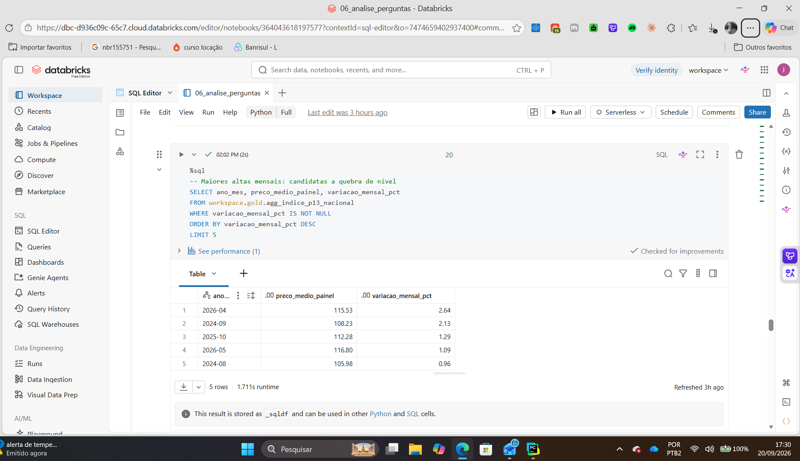

| Mês | Preço do painel | Variação |
|---|---:|---:|
| abril/2026 | R$ 115,53 | **+2,64%** |
| setembro/2024 | R$ 108,23 | +2,13% |
| outubro/2025 | R$ 112,28 | +1,29% |

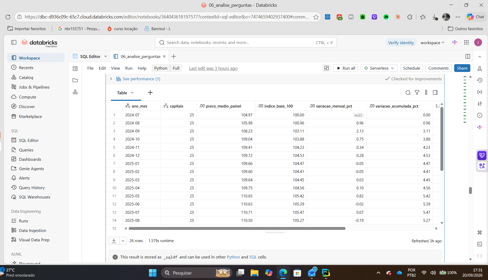

**Discussão.** A série tem três movimentos. Sobe de julho a dezembro de 2024
(+4,5%), fica praticamente estável por quinze meses (+2,7% de dezembro/2024 a
março/2026), e dá um salto concentrado em abril e maio de 2026 (+3,8% em dois
meses). Os últimos três meses mostram leve queda.

O salto de abril de 2026 é a quebra de nível mais clara. Aparece tanto na série
bruta quanto no painel balanceado, o que descarta artefato de composição  é
preço, não amostra. Os dados desta base não permitem atribuir causa. Reajuste
de distribuidora, variação cambial, mudança tributária ou alteração regulatória
são hipóteses igualmente compatíveis, e testá-las exigiria séries externas.

Em esforço orçamentário, o índice mostra a travessia de um limiar: em julho de
2024 o botijão médio das capitais custava 96,3% da linha mensal de extrema
pobreza per capita; em agosto de 2026, **106,4%** — passou a custar mais que a
renda mensal inteira de uma pessoa nessa linha.

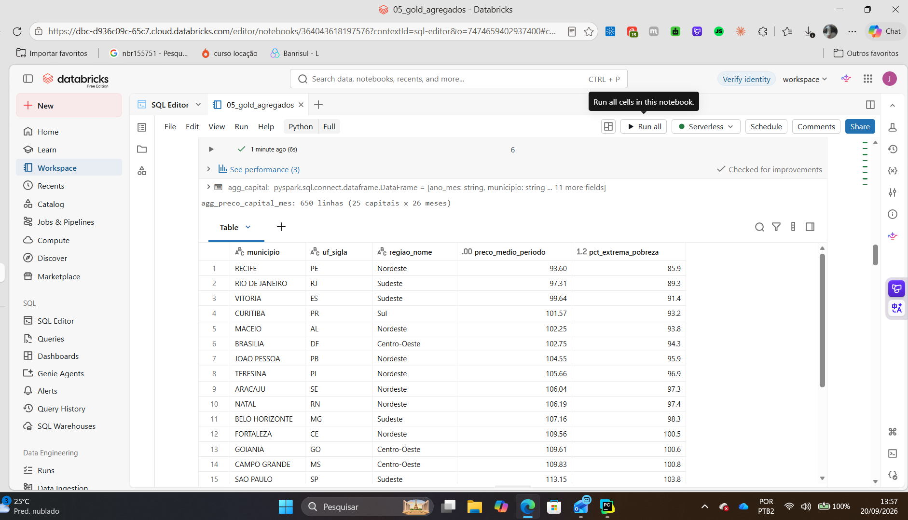

## Pergunta 6 — As regiões se movem juntas?

| | CO | NE | N | SE | S |
|---|---:|---:|---:|---:|---:|
| **Centro-Oeste** | 1,00 | 0,85 | 0,46 | 0,83 | 0,75 |
| **Nordeste** | 0,85 | 1,00 | 0,65 | 0,81 | 0,78 |
| **Norte** | 0,46 | 0,65 | 1,00 | 0,41 | 0,45 |
| **Sudeste** | 0,83 | 0,81 | 0,41 | 1,00 | 0,84 |
| **Sul** | 0,75 | 0,78 | 0,45 | 0,84 | 1,00 |

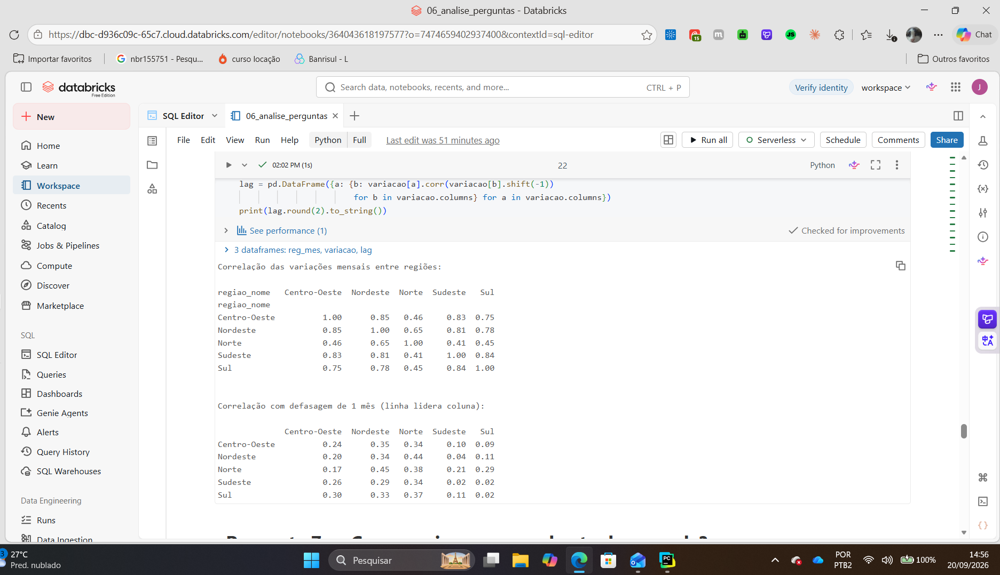

Centro-Oeste, Nordeste, Sudeste e Sul se movem juntos, com correlações entre 0,75
e 0,85. **O Norte acompanha de forma sistematicamente mais fraca**, entre 0,41 e
0,65 — maior afinidade com o Nordeste (0,65), menor com o Sudeste (0,41).

A evidência mais clara não está na matriz, e sim no episódio de abril de 2026:

| Região | Variação em abril/2026 |
|---|---:|
| Centro-Oeste | +3,79% |
| Nordeste | +3,20% |
| Sudeste | +3,10% |
| Sul | +2,13% |
| **Norte** | **+0,91%** |

Um choque que atingiu quatro regiões com intensidade semelhante e mal tocou a
quinta.

**Discussão.** O padrão é compatível com um mercado nacional razoavelmente
integrado do Centro-Oeste para o sul e o leste, e um Norte que responde a
dinâmica própria — o que faz sentido para uma região cuja logística de suprimento
depende de modal fluvial e distâncias muito maiores. O Norte é simultaneamente a
região mais cara (pergunta 1) e a menos sincronizada, e as duas características
provavelmente têm a mesma origem.

**Ressalva.** São 25 variações mensais. Os números são descritivos, não
inferenciais, e não comportam leitura de significância estatística. Testes com
defasagem de um mês não revelaram padrão — todas as correlações defasadas ficaram
entre 0,02 e 0,45, sem estrutura.

## Pergunta 7 — Margem bruta da revenda

**Não respondível.**

| Registros | Com `valor_compra` | Percentual |
|---:|---:|---:|
| 271.945 | **0** | 0,00% |


O cálculo exigiria `valor_venda − valor_compra`. O campo existe no layout
publicado pela ANP mas vem vazio em todos os registros do período. Os metadados
oficiais confirmam: a série de preço de distribuição está disponível apenas **até
agosto de 2020**.

A verificação é dupla, sendo documental, pelos metadados da fonte, e empírica, pela
contagem acima. A impossibilidade é característica da fonte, não falha do
pipeline: a coluna foi preservada em todas as camadas, com a descontinuidade
registrada no catálogo, de modo que uma eventual retomada da série seria
absorvida sem alteração do modelo.

## Discussão geral

O problema formulado era entender o que explica a dispersão do preço do GLP P13
no Brasil e qual o impacto dessa dispersão sobre o orçamento doméstico. O P13 é um
produto homogêneo, de modo que toda variação observada vem de geografia,
distribuição, concorrência local ou tempo.

**A dispersão existe em duas escalas, e a distinção entre elas é a principal
conclusão deste trabalho.**

O **ruído acionável** opera dentro da cidade: BRL 7,86 de mediana entre o preço
médio e o mais barato da mesma semana, chegando a mais de BRL 20,00 nos municípios
de maior dispersão. A pergunta 4 sugere um mecanismo  onde há mais revendas, há
mais de onde escolher  e a pergunta 3 acrescenta que, no Sul e no Sudeste, optar
pela bandeira branca soma outros BRL 2,00. Essa parcela está ao alcance de quem
pode consultar três revendas antes de comprar.

O **ruído estrutural** opera entre regiões: R$ 44,63 entre Recife e Boa Vista,
uma hierarquia que não se alterou em dois anos e um Norte que sequer acompanha o
movimento nacional de preços. Nenhuma decisão do consumidor afeta essa parcela.
Ela é determinada pelo CEP.

Em esforço orçamentário o resultado é concreto: **em 14 das 25 capitais** do painel
um botijão custa mais que a linha mensal de extrema pobreza por pessoa. Em Boa
Vista, 26,8% a mais. E a série cruzou esse limiar durante o período analisado. A
média nacional das capitais passou de 96,3% para 106,4% da linha entre julho de
2024 e agosto de 2026.

Isso delimita o alcance de políticas de transferência. O Programa Gás do Povo
(Decreto nº 12.649/2025) oferece gratuidade na recarga para famílias do Cadastro
Único em revendas credenciadas voluntariamente. Para as famílias fora do
programa, para as que esgotam a cota do período e para as que moram onde nenhuma
revenda aderiu, o preço analisado aqui continua sendo o preço cheio.

**O que a análise não permite afirmar.** Não há como atribuir causa ao salto de
abril de 2026. A relação entre concorrência e preço é fraca, condicional à região
e não estabelece causalidade. A menor sincronia do Norte é compatível com
explicação logística mas não a comprova. E a base cobre 421 municípios de cerca
de 5.570. Todas as conclusões valem para municípios de porte médio para cima, e
nada se pode dizer sobre o interior pequeno, onde a pesquisa da ANP não chega.

---

# Autoavaliação

## Atingimento dos objetivos

Dos sete objetivos traçados antes do início do trabalho, seis foram atingidos
integralmente e **um** se mostrou impossível com a fonte escolhida.

| # | Pergunta | Situação |
|---|---|---|
| 1 | Variação regional e sua estabilidade | Respondida |
| 2 | Dispersão intramunicipal | Respondida |
| 3 | Bandeira branca | Respondida |
| 4 | Concorrência local | Respondida, com ressalva importante |
| 5 | Evolução temporal | Respondida parcialmente |
| 6 | Sincronia entre regiões | Respondida |
| 7 | Margem bruta da revenda | **Não respondível** |

A pergunta 7 foi mantida no objetivo conforme o enunciado. A impossibilidade tem
causa concreta, pois a ANP descontinuou a publicação do preço de distribuição em
agosto de 2020. Isso só foi descoberto após a coleta.

A pergunta 5 foi respondida apenas em parte. O *quanto* está medido com precisão
(+10,50% em 26 meses, com quebra de nível identificada em abril de 2026), mas o
*porquê* do salto permanece sem resposta. Responder exigiria séries externas de
câmbio, tributos e preços de distribuidora.

A pergunta 4 mereceu tratamento mais cuidadoso do que o previsto. O resultado
agregado não confirma a hipótese, e só o controle por região revela a relação. A
tentação de apresentar apenas a correlação por região, omitindo que o agregado a
contradiz, foi evitada sendo os dois resultados que estão no documento.

## Experiência prévia e o que mudou

O Autor havia trabalhado com este mesmo conjunto de dados na Univates, na disciplina
de Análise e Modelagem de Dados, primeiro em **Bonita Software** e depois em
**Power BI**. A familiaridade com a base acelerou a fase de definição do problema
e das perguntas.

O que mudou foi a natureza do trabalho. Nas experiências anteriores o foco estava
na modelagem de processo e na visualização onde o dado chegava pronto para consumo.
Aqui a maior parte do esforço ficou nas etapas anteriores à análise: coleta
reprodutível, perfilagem de qualidade, normalização, modelagem dimensional e
validação. É a diferença entre consumir dados e construir a infraestrutura que os
torna consumíveis.

## Dificuldades encontradas

**A plataforma.** O Databricks Free Edition foi a principal dificuldade, por ser
uma ferramenta nova para mim e por ter limitações que exigiram adaptação:

- Não permite criar catálogos adicionais. A arquitetura medalhão foi implementada
  como três schemas dentro do catálogo `workspace` — solução que preserva a
  separação lógica e está documentada.
- Volumes do Unity Catalog são montados via FUSE e não suportam escrita com
  posicionamento aleatório, o que fez a geração do arquivo Excel falhar com
  `OSError: Errno 5`. Resolvido gravando em disco local e copiando em seguida.
- O compute serverless emite avisos de janela sem partição em operações de
  `lag` sobre séries pequenas, inofensivos nesta escala mas confusos à primeira
  vista.

Apesar disso, a plataforma atendeu integralmente aos requisitos do trabalho, e o
Unity Catalog em particular se mostrou mais capaz do que eu esperava de uma
edição gratuita.

**A qualidade dos dados de origem.** O defeito de formato do CNPJ foi o problema
mais sério e o mais difícil de detectar, porque não gera erro: o pipeline roda,
as tabelas são criadas, e a contagem de revendas simplesmente fica 74% maior do
que deveria. Foi identificado apenas porque a perfilagem testou o padrão do campo
arquivo por arquivo.

**Distinguir defeito de dado de defeito de comparabilidade.** A variação da
cobertura amostral não é um dado errado cada registro está correto. O problema
é comparar médias calculadas sobre conjuntos diferentes de municípios. Reconhecer
isso como problema de qualidade, e não como característica inocente, foi o
raciocínio mais difícil do trabalho.

## O que as validações capturaram

Foram implementadas 65 checagens automatizadas comparando os resultados do Spark
contra uma implementação de referência em pandas. Duas capturaram erros reais:

**Arredondamento intermediário.** O índice de preço estava sendo calculado sobre
médias já arredondadas para dois decimais, resultando em 110,49 em vez de 110,50.
Arredondar valor intermediário e depois dividir propaga o erro. A boa prática é
arredondar apenas na apresentação.

**Média ponderada por intensidade de coleta.** O preço médio de cada capital
estava sendo calculado sobre todas as coletas do período, o que dá mais peso aos
meses em que a pesquisa foi mais intensa. Fortaleza, com meses de 3 coletas e
outros de dezenas, divergia em R$ 1,58 entre os dois cálculos. Como o painel
existe justamente para neutralizar variação de intensidade, a média de médias é a
coerente.

Nenhum dos dois produziria erro visível. Os dois produziriam números sutilmente
errados que ninguém questionaria. Em engenharia de dados, o erro perigoso não é o que quebra o pipeline é o que
passa sem ser visto.

## Trabalhos futuros

**Ponderação populacional do índice.** O índice atual usa peso igual entre as 25
capitais, o que sobrerrepresenta Norte e Nordeste frente ao peso populacional.
Ponderar por número de domicílios do Censo 2022, fixados no período-base,
tornaria o índice um Laspeyres próprio.

**Deflacionamento.** A variação de +10,50% é nominal. Compará-la ao IPCA do mesmo
período diria se o gás de cozinha subiu acima ou abaixo da inflação geral, o que
transformaria um número técnico em achado com significado social.

**Cruzamento com o Programa Gás do Povo.** A Caixa mantém base de revendas
credenciadas. O join com `dim_revenda` seria direto, já que a chave CNPJ
normalizado está pronta. Permitiria medir a cobertura do programa por município
e verificar se revendas credenciadas praticam preços diferentes.

**Custo de primeira aquisição.** A base mede o preço de recarga, que é o custo de
quem já possui o vasilhame. O custo de entrada (casco + gás) é cerca de 1,5 a 2
vezes maior e representa a barreira de acesso ao GLP para domicílios recém-formados. Não há série pública desse valor, o que sugere uma lacuna de dados
abertos.

**Ampliação para outros combustíveis.** A ANP publica gasolina, etanol, diesel e
GNV no mesmo layout. A `dim_produto` existe justamente como ponto de extensão, e
o pipeline absorveria os demais produtos sem alteração estrutural.

**Automação da ingestão.** O pipeline é executado manualmente. Um job agendado no
Databricks, lendo o arquivo de quatro últimas semanas que a ANP publica, tornaria
a série incremental.


---

## Estrutura do repositório

```
.
├── README.md                          
├── coleta_anp_glp.py                  
├── referencia_pipeline_glp.py        
│                                      
│                                      
├── notebooks/                         
│   ├── 00_ingestao_bronze.py
│   ├── 01_bronze_para_silver.py
│   ├── 02_gold_dimensoes.py
│   ├── 03_gold_fato.py
│   ├── 04_qualidade_dados.py
│   ├── 05_gold_agregados.py
│   ├── 06_analise_perguntas.py
│   └── 07_exportar_resultados.py
└── docs/
    ├── MANIFEST.md                    
    ├── metadados_anp.pdf              
    ├── resultados_analise_glp.xlsx   
    └── img/                           
```
